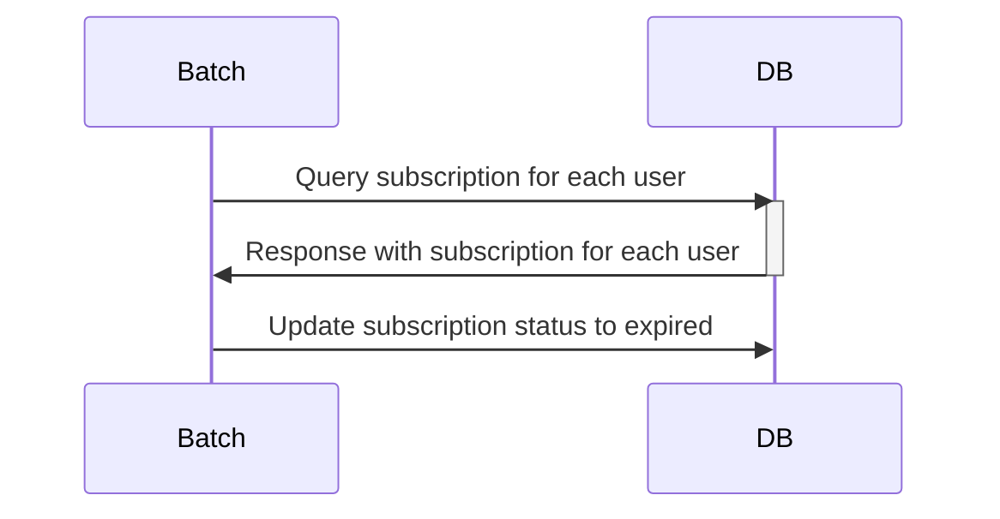
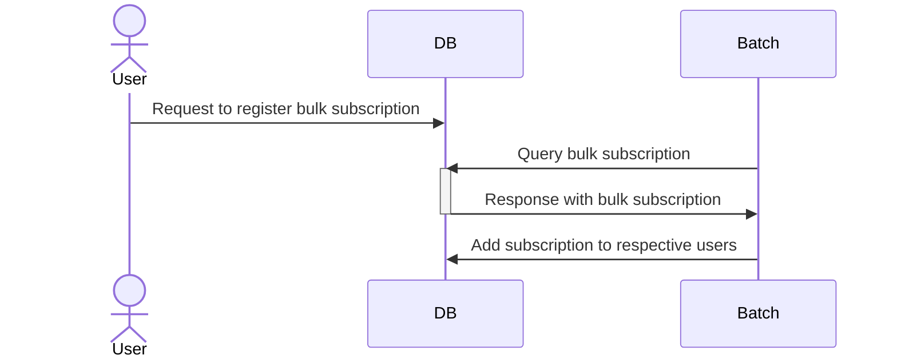
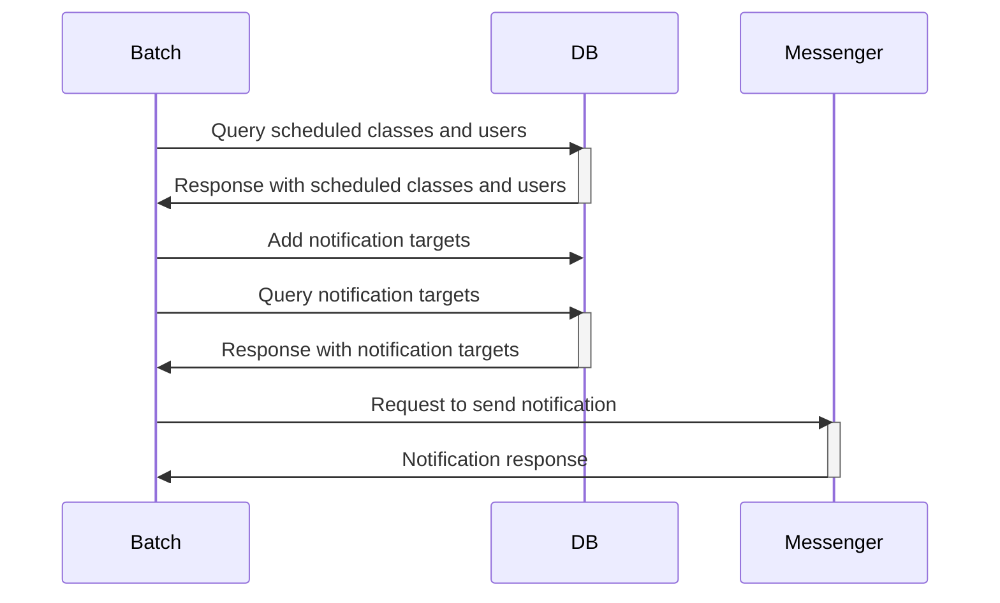
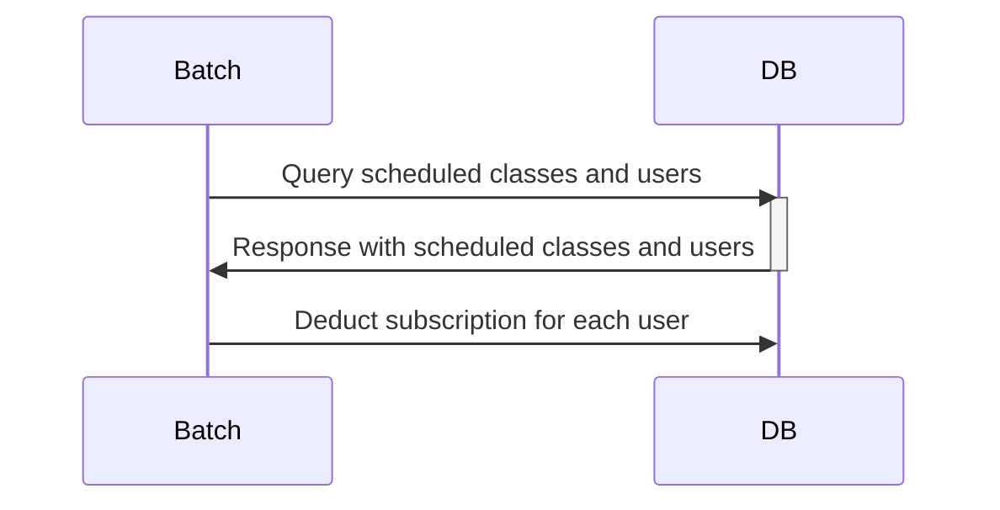

# pass-batch

This is the batch repository for the PT Subscription Management Service. It provides the following functionalities: subscription expiry, bulk subscription grant, pre-class notification, and post-class subscription deduction.

## Environments
* OpenJDK 18.0.1
* Spring Boot 2.7.3
* Gradle
* MySQL (Docker)
* JPA
* lombok
* ModelMapper

## Why Choose Spring Batch? 
### Key Differences:

- **Batch Usage**: By automating large volumes of data and repetitive tasks, you can efficiently handle them in the background. This ensures stability by allowing system recovery and re-execution from the last checkpoint in case of failures. Tasks that need to be executed periodically (e.g., checking for subscription expiration at midnight) can be easily implemented.

- **Environment**: Spring Batch integrates seamlessly with Java applications, leveraging Java's ecosystem for robust data processing capabilities. Crontab, in contrast, operates as a fundamental command on Unix and Linux systems, executing shell scripts or commands at scheduled intervals.

### Spring Batch Metadata Tables
- the tables in the Spring Batch schema are designed to support retry and transaction management for batch job executions. 
- Here’s how they contribute to these functionalities
  - Retry Management
    - Retry Works at the Point of Error
    - Retry Count and Backoff Policies
  - Transaction Management

## Process
### JOB1. Subscription Expiry
* `chunk step`
* Read the targets for subscription expiry (ExpirePassesReader) and update their status to expired (ExpirePassesWriter)

### JOB2. Bulk Subscription Grant
* `tasklet step`
* When registered by the admin, the subscriptions are granted to users at a specified time (AddPassesTasklet)

### JOB3. Pre-class Notification
* `multiple thread chunk step`
* -> Parallel processing provided by Spring Batch
1. Step1: Retrieve the targets for notification
2. Step2: Send the notifications

### JOB4. Post-class Subscription Deduction
* `chunk step`
* UserPassesReader -> AsyncItemProcessor -> AsyncItemWriter

# Job Scheduling
## AddPassesJob 
### Description

## makeStatisticsJob 
### Description

