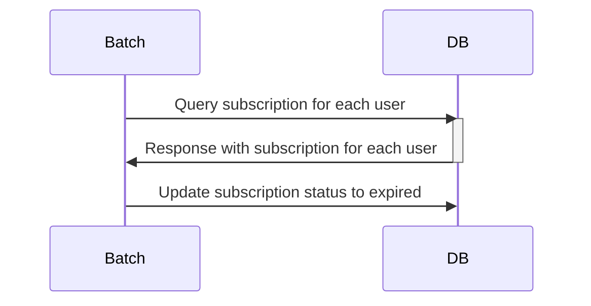
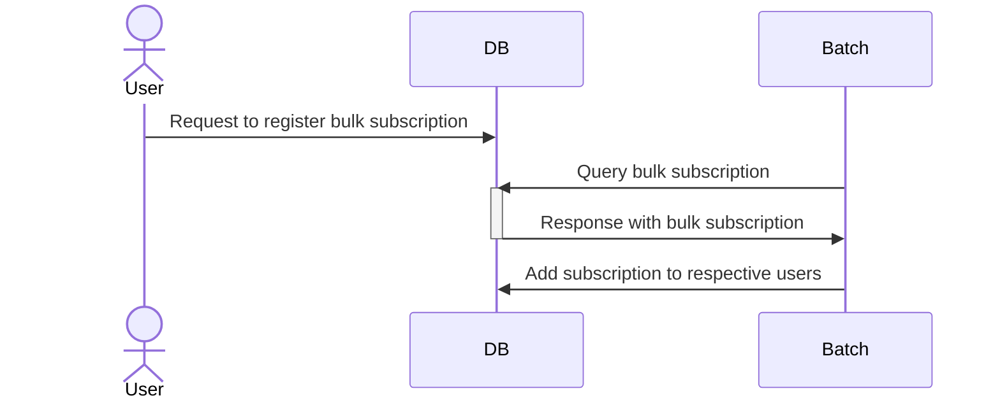
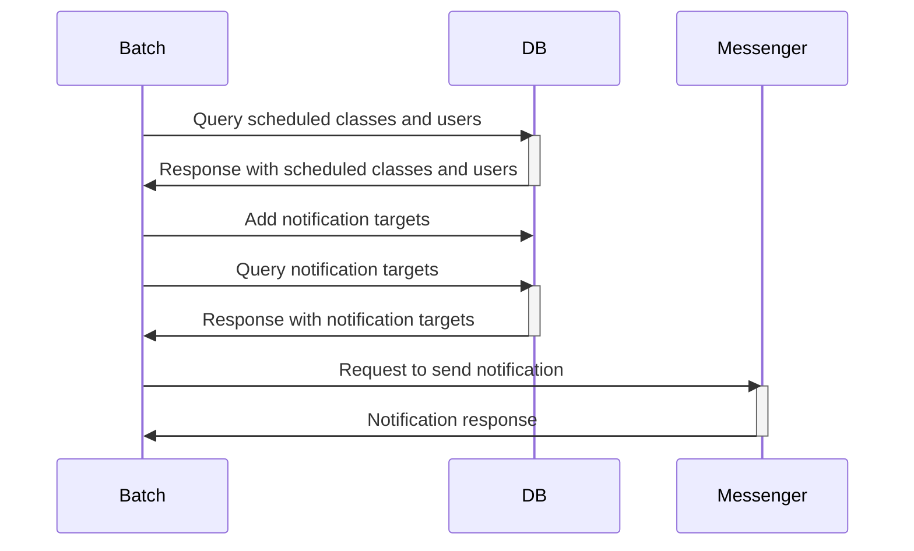
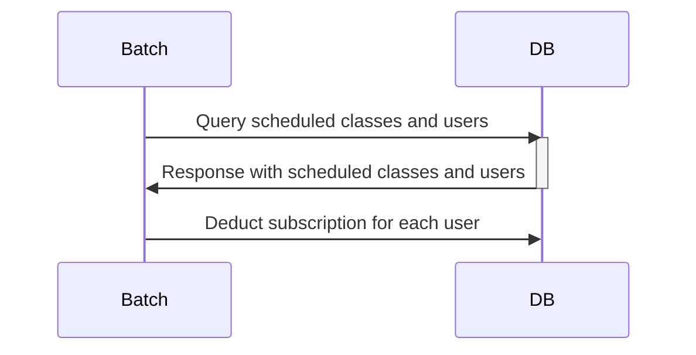

# pass-batch

This is the batch repository for the PT Subscription Management Service. It provides the following functionalities: subscription expiry, bulk subscription grant, pre-class notification, and post-class subscription deduction.

## Environments
* OpenJDK 18.0.1
* Spring Boot 2.7.3
* Gradle
* MySQL (Docker)
* JPA
* lombok
* ModelMapper

## Process
### Subscription Expiry
### JOB1. 이용권 만료
* `chunk step`
* Read the targets for subscription expiry (ExpirePassesReader) and update their status to expired (ExpirePassesWriter)

### Bulk Subscription Grant
* `tasklet step`
* When registered by the admin, the subscriptions are granted to users at a specified time (AddPassesTasklet)

### Pre-class Notification
* `multiple thread chunk step`
* -> Parallel processing provided by Spring Batch
1. Step1: Retrieve the targets for notification
2. Step2: Send the notifications

### Post-class Subscription Deduction
* `chunk step`
* UserPassesReader -> AsyncItemProcessor -> AsyncItemWriter

# Job Scheduling
## AddPassesJob 
### Description

## makeStatisticsJob 
### Description

