# How to Run
### step 1. Run Docker Compose
```
docker-compose up -d
```
### step 2. Run Spring Boot Application

### step 3. Run web [front-end repo](https://github.com/KyleKim107/pass-web)

# project Overview
 - **Web** : Represents the frontend interacting with users.
- **API** : Acts as a bridge between the Web and DB/Batch components.
- **DB (MySQL)**: Central data storage accessed by both the API and Batch.
- **Batch**: Background processing unit handling intensive tasks and periodic jobs.
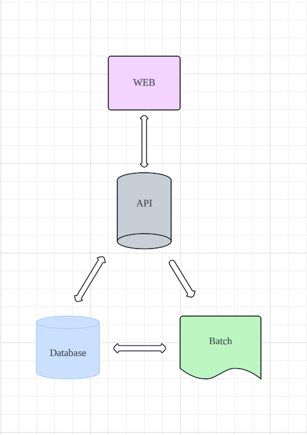

# pass-batch 

This is the batch repository for the PT Subscription Management Service. It provides the following functionalities: subscription expiry, bulk subscription grant, pre-class notification, and post-class subscription deduction.

## Environments
* OpenJDK 18.0.1
* Spring Boot 2.7.3
* Gradle
* MySQL (Docker)
* JPA
* lombok
* ModelMapper

## Why Choose Spring Batch? 
### Key Differences:

- **Batch Usage**: By automating large volumes of data and repetitive tasks, you can efficiently handle them in the background. This ensures stability by allowing system recovery and re-execution from the last checkpoint in case of failures. Tasks that need to be executed periodically (e.g., checking for subscription expiration at midnight) can be easily implemented.

- **Environment**: Spring Batch integrates seamlessly with Java applications, leveraging Java's ecosystem for robust data processing capabilities. Crontab, in contrast, operates as a fundamental command on Unix and Linux systems, executing shell scripts or commands at scheduled intervals.

### Spring Batch Metadata Tables
- the tables in the Spring Batch schema are designed to support retry and transaction management for batch job executions. 
- Here’s how they contribute to these functionalities
  - Retry Management
    - Retry Works at the Point of Error
    - Retry Count and Backoff Policies
  - Transaction Management


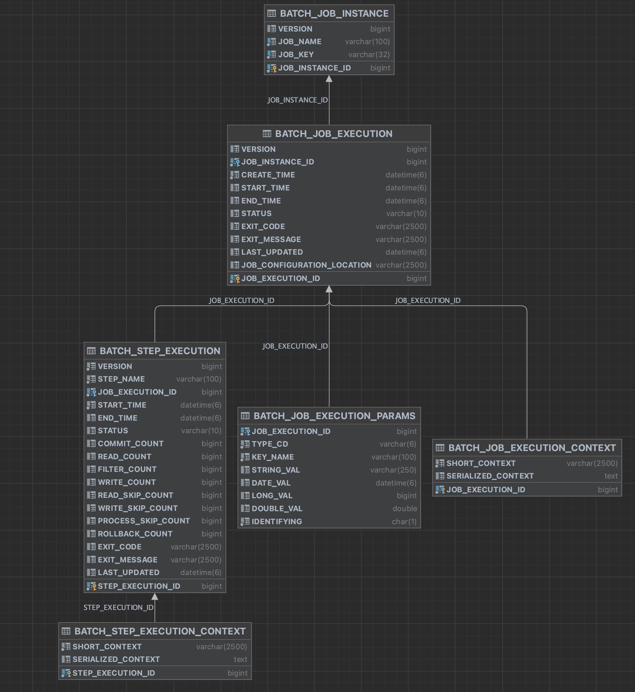


## Process
### JOB1. Subscription Expiry
* `chunk step`
* Class: ExpirePassesJobConfig
  * expirePassesJob: 
    1. Read the targets for subscription expiry (ExpirePassesReader)
    2. Update their status to expired (ExpirePassesWriter)
* Read the targets for subscription expiry (ExpirePassesReader) and update their status to expired (ExpirePassesWriter)
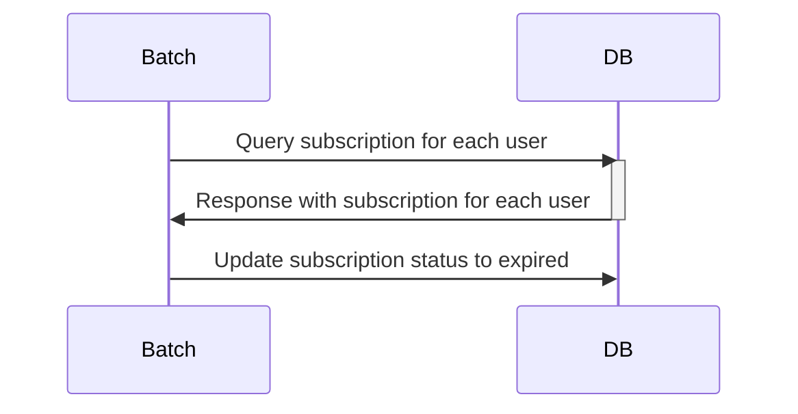

### JOB2. Bulk Subscription Grant
* `tasklet step`
* When registered by the admin, the subscriptions are granted to users at a specified time (AddPassesTasklet)
* Refer the User Use Case Below
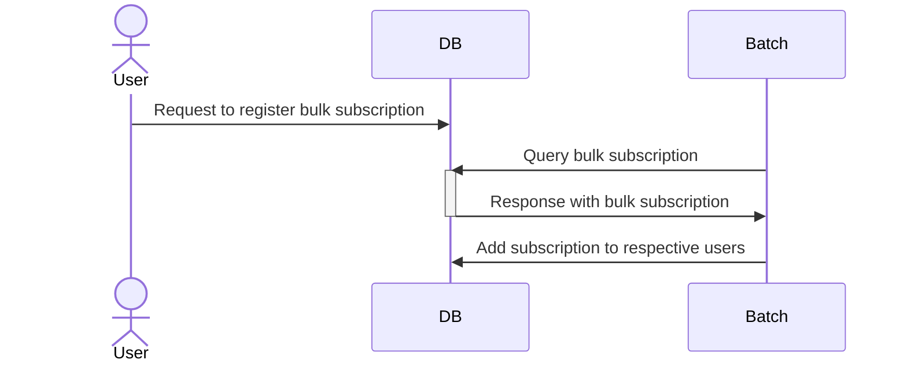

### JOB3. Pre-class Notification
* `multiple thread chunk step`
* -> Parallel processing provided by Spring Batch
1. Step1: Retrieve the targets for notification
2. Step2: Send the notifications
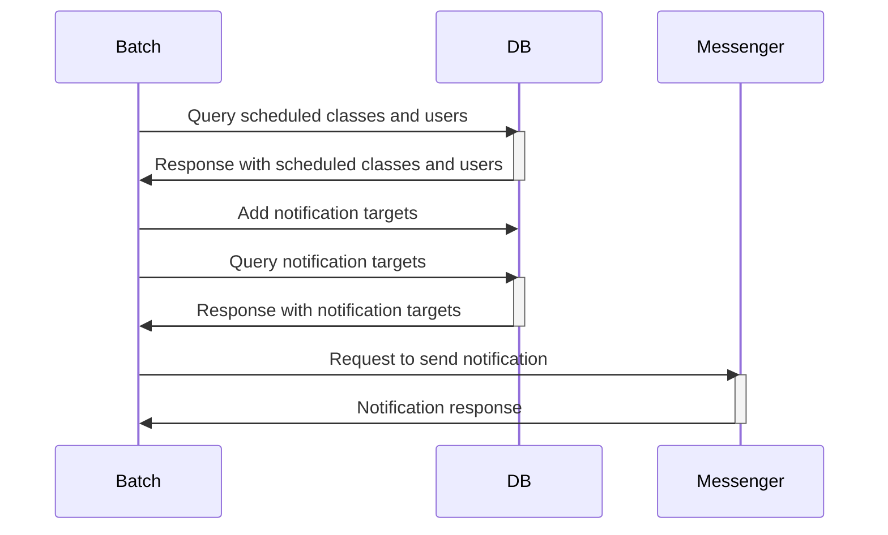

### JOB4. Post-class Subscription Deduction
* `chunk step`
* Class: UsePassesJobConfig
  * usePassesJob: Deduct the subscription from the users who attended the class
* UserPassesReader -> AsyncItemProcessor -> AsyncItemWriter
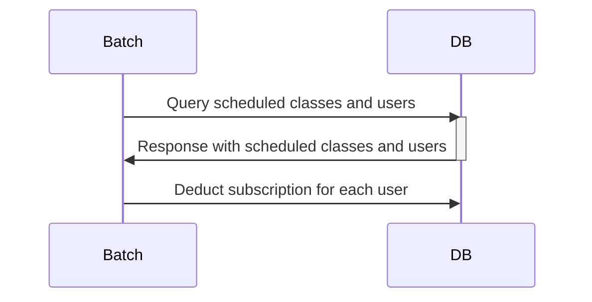
## User Use Case
### AddPassesJob
- Add a bulk pass 
  - `Member Group Id` is the group id of the users who will receive the passes
- access url: http://localhost:8081/admin/bulk-pass
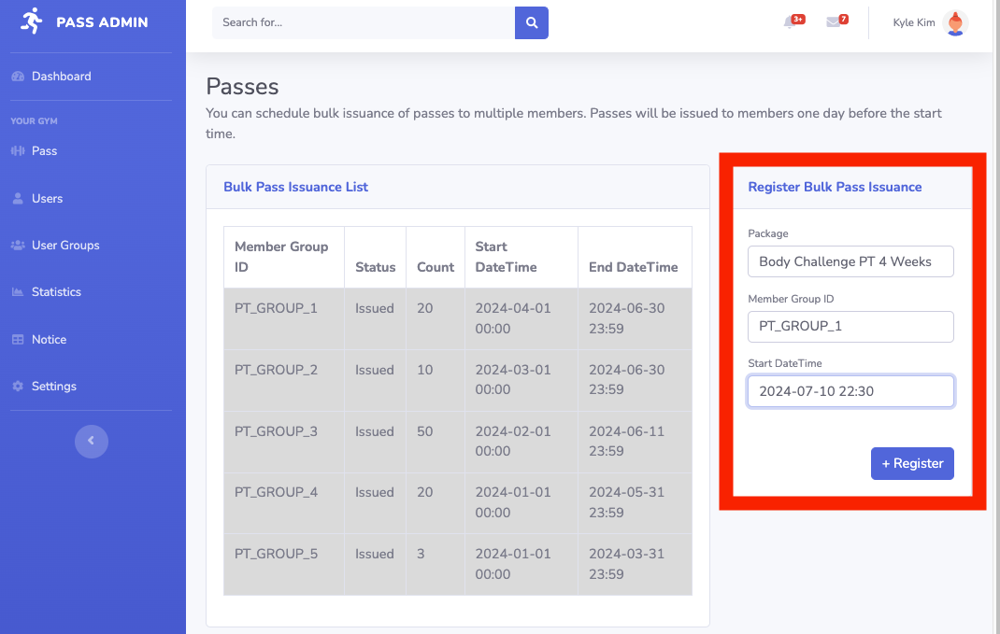
- Confirm the passes to be added
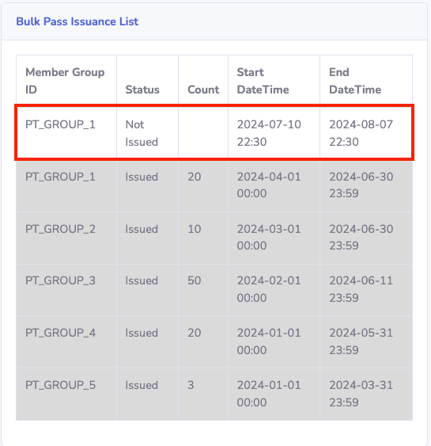
- Issue the passes to the users <br>
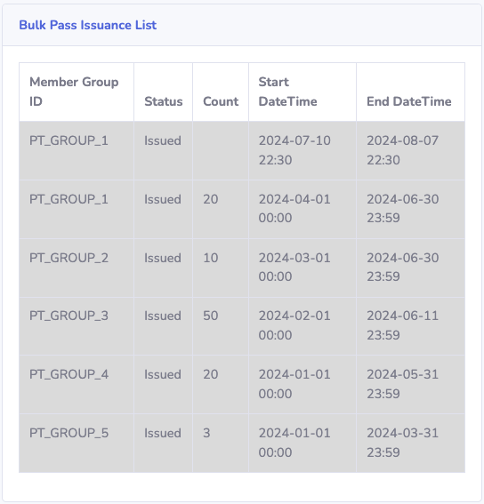
- Run the job
  - the batch job adds passes to the users who belong to the `Member Group Id`<br>
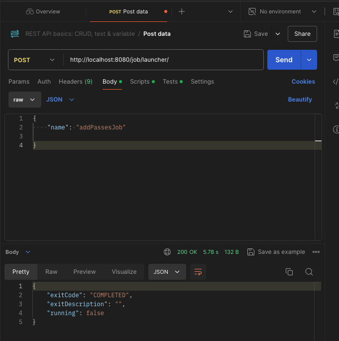
- Check the result
  - the passes have been successfully added to the users
- access url: http://localhost:8081/passes?userId=<user_id>
  - ex> http://localhost:8081/passes?userId=A1870662
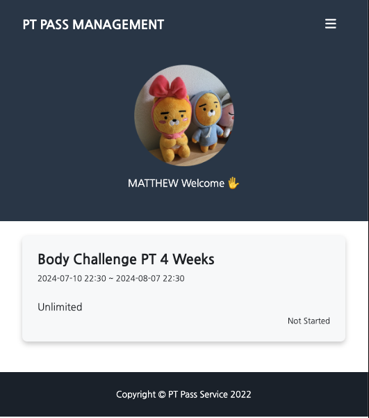

## makeStatisticsJob 
- Check the statistics page
  - the statistics page shows the number of attendances (blue) and the number of absent (red)
- access url: http://localhost:8081/admin?to=<today_date>
  - EX > access url: http://localhost:8081/admin?to=2024-07-11
  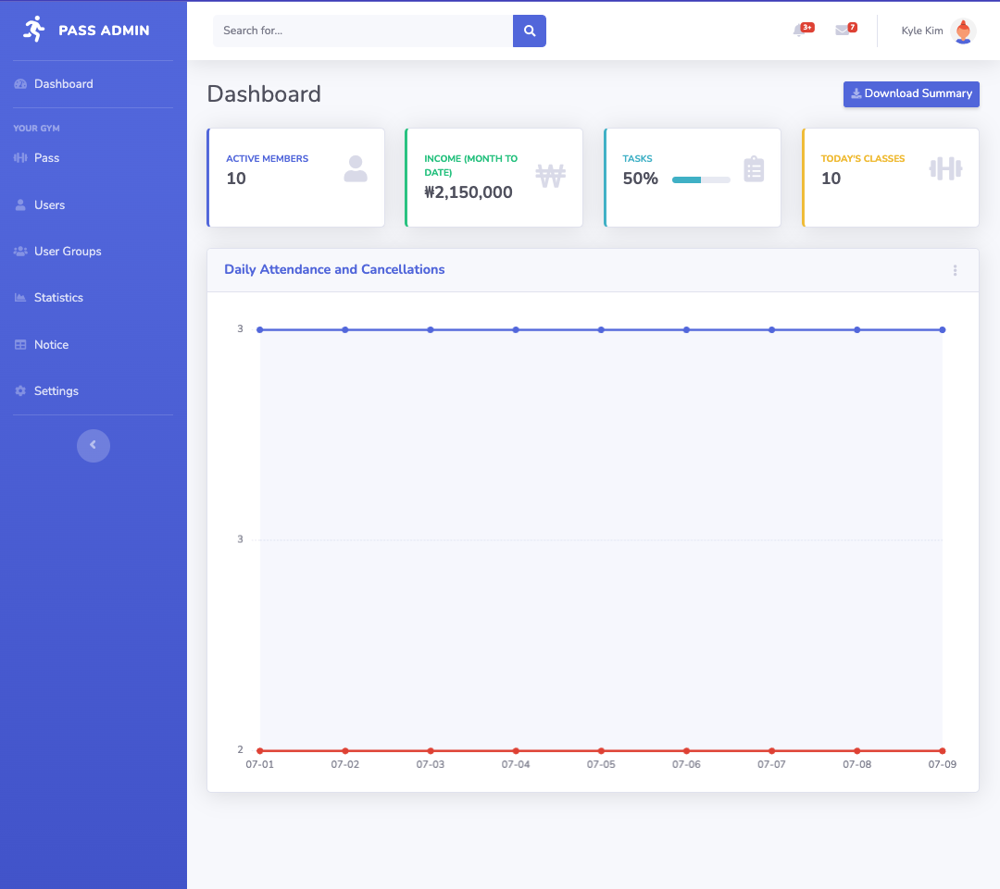
- Run the job
  - the job has been successfully executed
  - retrieve booking entities that has ended date during the date range in the job parameter.
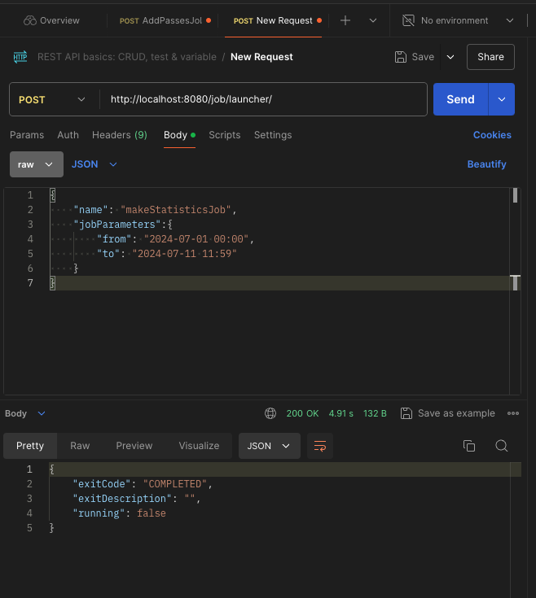
- the statistics have been successfully updated with demo data
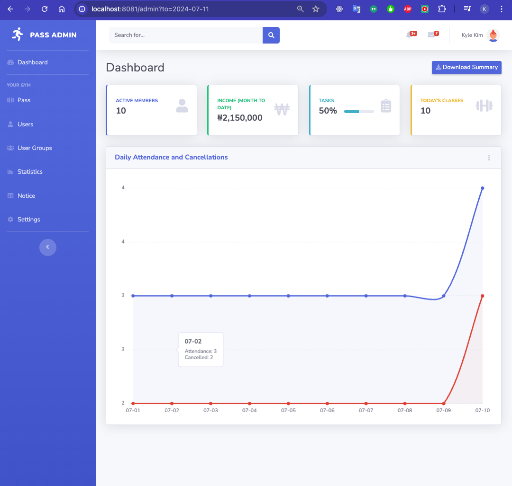
- Export the statistics to a CSV file
  - the statistics have been successfully exported to a CSV file
  - field info
    - data and time
    - the number of attendances
    - the number of absent
    - the number of total booking
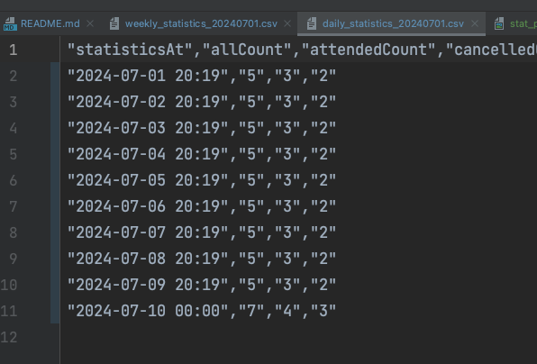
- Check the weekly statistics
  - the weekly statistics have been successfully updated with demo data
  - field info
    - the number of week in the year
    - attendances
    - absent
    - total booking
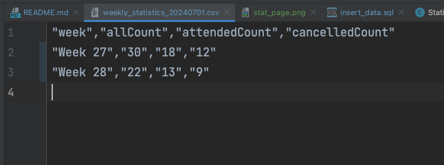