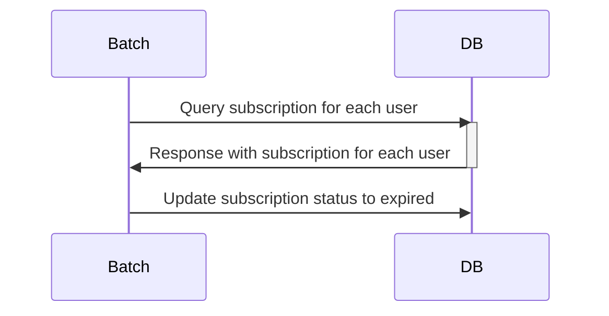
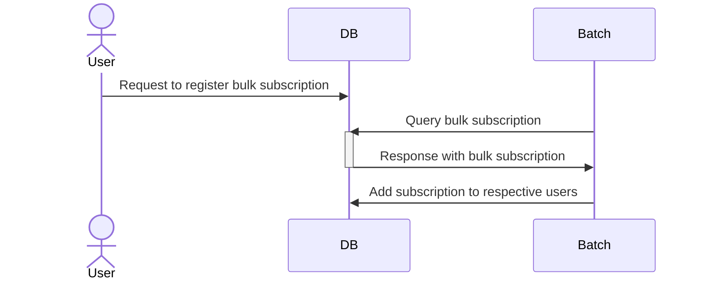
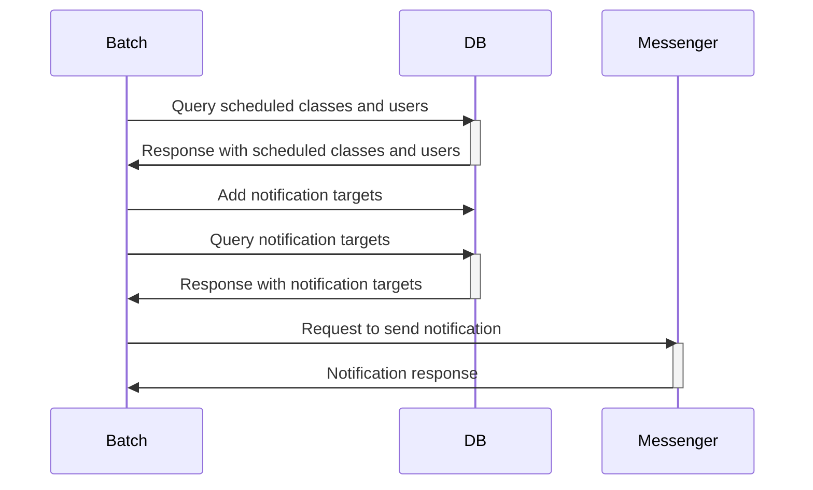
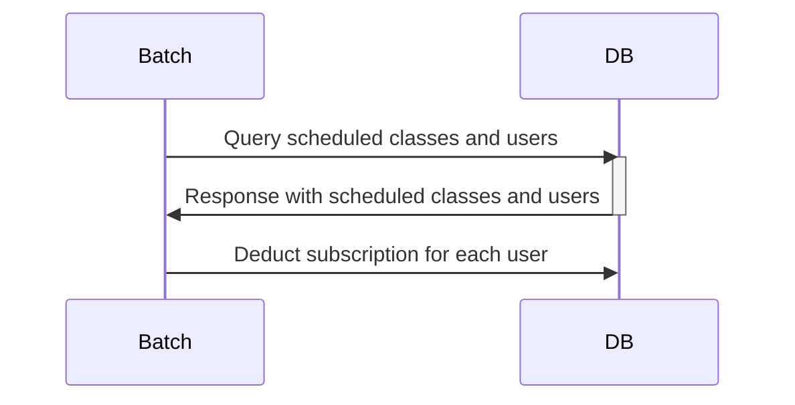

# pass-batch

PT 이용권 관리 서비스 내 배치 repository 입니다.
이용권 만료, 일괄 지급, 수업 전 알림, 수업 후 이용권 차감 기능을 제공합니다.

## Environments
* OpenJDK 18.0.1
* Spring Boot 2.7.3
* Gradle
* MySQL (Docker)
* JPA
* lombok
* ModelMapper

## Process
### 이용권 만료

### 이용권 일괄 지급

### 수업 전 알림

### 수업 후 이용권 차감

